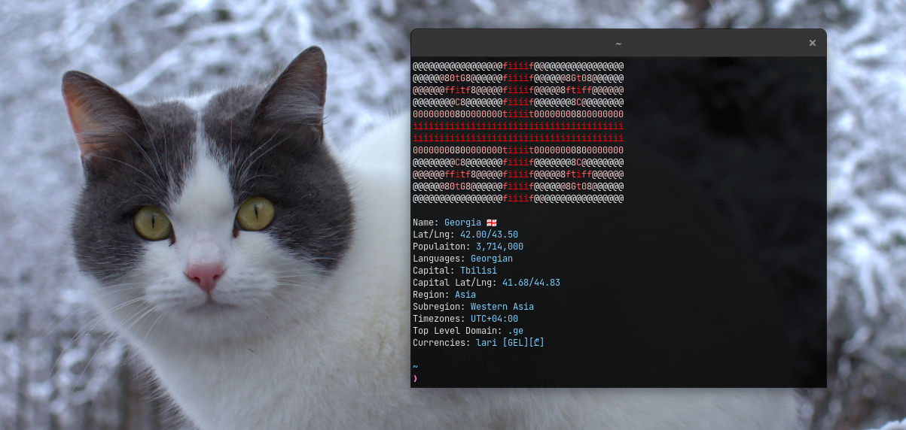

# Countryfetch

A cli tool for fetching information about countries. A Go alternative to my original
[countryfetch](https://github.com/CondensedMilk7/countryfetch) which is written in TypeScript (Deno).
It uses https://restcountries.com/ for back-end.



# Installation & Usage

Make sure you have [GO](https://go.dev/) installed and run this one-line installer:

```bash
go install github.com/CondensedMilk7/countryfetch-go/cmd/countryfetch@latest
```

If you have the original `countryfetch` and you want to keep it, do this instead:

```bash
git clone https://github.com/CondensedMilk7/countryfetch-go.git && cd ./countryfetch-go && go build ./cmd/countryfetch/ -o countryfetch-go && cp ./countryfetch-go ~/.local/bin/
```

First make sure you run `countryfetch -sync`, optionally with `-flag` to store data in cache.

```
USAGE:
  -capital string
    	Find country by given capital.
  -flag
    	Include ASCII flag in the operation. Can be used in combination with -sync & -name.
  -flagonly
    	Print flag only. Must be used with -name.
  -flagremote
    	Print flag via remote URL. Can be used in combination with -flagonly. Must be used with -name.
  -height int
    	Specify flag height. Can be used with -flagremote and -sync -flags (default 12)
  -help
    	Get usage help
  -name string
    	Find country by given name.
  -sync
    	Fetch and save data to cache.
  -width int
    	Specify flag width. Can be used with -flagremote and -sync -flags (default 40)
EXAMPLE:
  countryfetch -name italy -flag
        Fetch information about Italy, including its flag.
  countryfetch -sync -flag
        Store information of all countries in cache, including generated flag ASCII art.
  countryfetch -capital "kuala lumpur"
        Fetch information about the country of given capital.
  countryfetch -flagonly -name "united states"
        Fetch just the flag of USA.

```

Note that string arguments with multiple words have to be enclosed in brackets.

# TypeScript (Deno) vs. Go


Here's a (little irrelevant) performance comparison between TypeScript and Go versions measured with `time` utility:

### Regular fetch

**TypeScript(Deno)**
```
countryfetch south korea  0.20s user 0.02s system 100% cpu 0.215 total
```

**Go**

```
countryfetch -flag -name "south korea"  0.01s user 0.00s system 105% cpu 0.014 total
```
### Generating ASCII and caching


**TypeScript(Deno)**
```
countryfetch sync flags  13.16s user 0.32s system 19% cpu 1:08.47 total
```

**Go**

```
countryfetch -sync -flag  7.92s user 0.30s system 35% cpu 23.377 total
```

# Tasks

- ~~Fetch flags remotely (directly, not from stored cache)~~
- ~~Fetch just the flag for a given country~~
- ~~CLI-configurable flag ASCII dimensions~~
- Support for Windows
